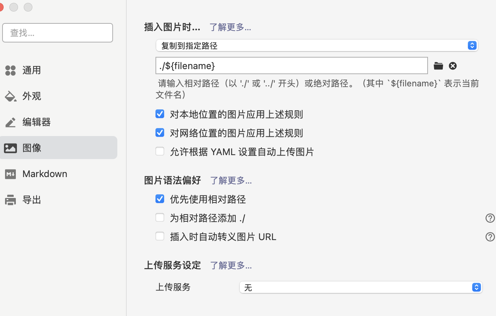
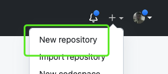
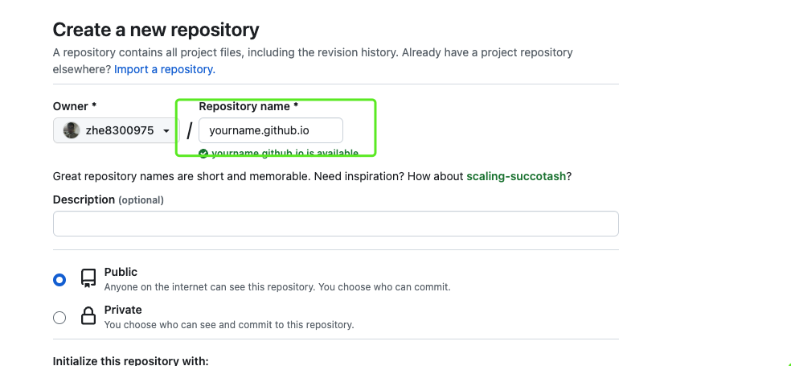
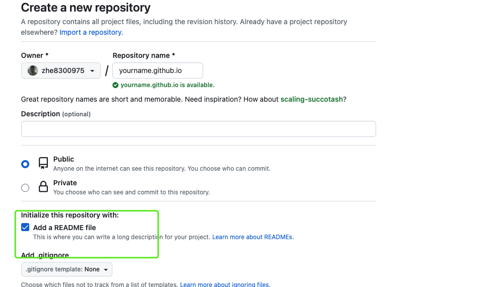
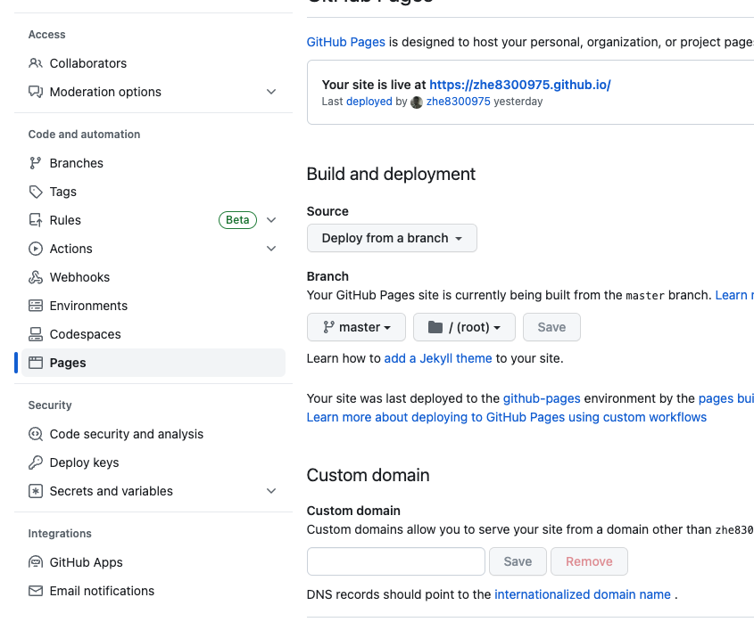

### 前言

本篇笔记主要记录本blog搭建流程，避免之后忘记


### 环境安装

#### 	Node.js安装

​	两种安装方式
 	1. 官网安装  [官网](https://nodejs.org/en)
 	2. 稳定版链接直接安装 [稳定版](https://nodejs.org/dist/v9.11.1/node-v9.11.1-x64.msi)

​	无论上述那种方式，安装只需要一路Next安装即可

 安装好后检测时候安装成功，打开命令行控制台

输入

```
node -v  //查看node.js 安装版本
npm -v //查看npm包管理器版本
```

#### 	Hexo安装

##### 	1. 创建一个合适文件夹

​		在合适的地方新建一个文件夹，用来存放自己的博文件夹

#####	 	2. 安装hexo
  1. 在该目录下打卡命令行控制台，并进入当前文件夹
  2. 命令行输入`npm i hexo-cli -g`安装Hexo。会有几个报错，无视它就行。
  3. 安装完后输入`hexo -v`验证是否安装成功

#### 	git安装

​	安装[地址](https://git-scm.com/downloads)

​	然后一路下一步就好了 

​	安装完后输入`git -v`验证是否安装成功


### 开始写作

##### 	初始化当前文件夹环境

1. 进入博客文件夹，并打开控制台
2. `hexo init`初始化文件夹
3. `npm install`安装必备的组件

##### 	生成新文章及文件

1. 安装一个扩展`npm i hexo-deployer-git`
2. 然后输入`hexo new post "article title"`，新建一篇文章。
3. 然后打开`博客文件\source\_posts`的目录，可以发现下面多了一个`.md`文件，就是你的文章文件啦。

##### 	文章生成预览

1. `hexo g`生成静态网页
2. `hexo s` 打开本地服务器
3. 然后浏览器打开[http://localhost:4000/](https://link.zhihu.com/?target=http%3A//localhost%3A4000/)，就可以看到我们的博客啦
4. 按`ctrl+c`关闭本地服务器

##### 	图片展示

​	这里有一个问题就是当我们复制图片的时候 会出现一个问题 本地markdown展示 远端生成不展示问题 

​	原因：

​	markdown 一般会把图片添加到`  `并进行展示，当静态网页生成时候会将xxx文件夹移动到外面 所以网页上就不会展示 如果改为`! [](image.jpg) `本地makdown就不会展示  具体原因可以详见[这个文档](https://cloud.tencent.com/developer/beta/article/1736563)

​	解决：

​	参考[文档](https://zhuanlan.zhihu.com/p/280758822)
​	
​	
 	1. 安装插件 `npm install hexo-image-link`
 	2. 修改`_config.yml`中的`post_asset_folder: true`
 	3. 然后输入`hexo new post "article title"`，新建一篇文章。
 	4. 然后打开`博客文件\source\_posts`的目录，可以发现下面多了一个文件夹和一个`.md`文件，一个用来存放你的图片等数据，另一个就是你的文章文件啦。
 	5. 如果利用是Trpora 进行写作 可以修改插入图片的位置 
 	



​	即可完美解决


#### 发布

##### 	创建github项目



##### 	填写自己的项目地址



##### 	添加readme 文件（不加的话，可能会不展示）

​	


##### 	设置pages	

​	setting中设置当前项目pager



##### 	链接本地git

​	将本地项目的git remote 添加为自己git仓库地址

##### 	发布

​	利用指令`hexo d`进行发布 然后请求 youtname.github.io 即可访问

#### 	

#### 源码保存

​	github创建一个dev分支进行 整体项目源码上传


> 截止以上你的blog 基本搭建完成


#### 样式修改

依据[hexo-theme-matery](https://github.com/blinkfox/hexo-theme-matery)进行修改的  之后继续完善


### 引用

【1】[超详细Hexo+Github博客搭建小白教程](https://zhuanlan.zhihu.com/p/35668237)

【2】[hexo-theme-matery](https://github.com/blinkfox/hexo-theme-matery)
